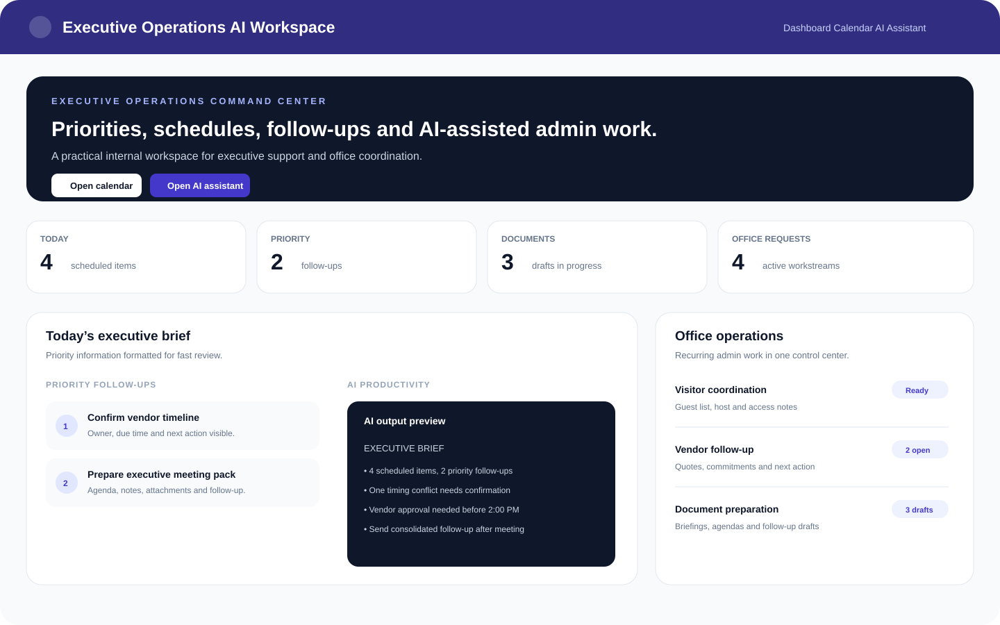

# Executive Operations AI Workspace

A React + TypeScript portfolio prototype showing how an Executive Assistant / Office Manager can combine calendar coordination, office operations, collaboration and practical AI workflows in one internal workspace.



> The preview above mirrors the executive dashboard included in the app. The project uses sample operational data and is intended as a portfolio demonstration.

## What the app demonstrates

### Executive support
- Executive daily brief with priorities, follow-ups and recent activity
- Calendar and task coordination with staff, service, date, time, notes and regional views
- Structured follow-up tracking so ownership and next actions stay visible
- Meeting and document workflow examples for agendas, minutes, briefings and email follow-up

### Office operations
- Visitor coordination
- Vendor follow-up
- Document preparation
- Supply / facility request tracking
- Shared files, folders, comments and activity history

### AI productivity
- Natural-language scheduling assistant
- Structured task extraction from free-form requests
- Daily chat summarization
- Executive-brief preview
- Meeting-notes to minutes workflow
- Follow-up email drafting workflow
- Office-request summarization workflow

## Sample workflow

1. An executive or team member sends an unstructured request.
2. The AI assistant interprets the request and extracts task details.
3. The task is added to the calendar with owner, date, service and notes.
4. The dashboard surfaces priorities and follow-ups.
5. Collaboration history, files and comments remain attached to the workflow.
6. AI can summarize updates into an executive-ready brief or follow-up draft.

## Technology

- React
- TypeScript
- Vite
- Gemini 2.5 Flash via `@google/genai`
- Browser storage for prototype persistence

## Why this project exists

The goal is not to build a generic chatbot. It is to demonstrate practical office productivity: reducing repetitive coordination, keeping responsibilities visible, organizing operational information, and using AI to turn unstructured requests into actionable work.

## Run locally

**Prerequisites:** Node.js and a Gemini API key.

1. Install dependencies:
   ```bash
   npm install
   ```
2. Add your Gemini API key to the local environment.
3. Start the development server:
   ```bash
   npm run dev
   ```

## Portfolio note

Independent prototype using sample data. Built to demonstrate workflow design, AI-assisted coordination, documentation and internal productivity concepts relevant to executive support and office operations.
